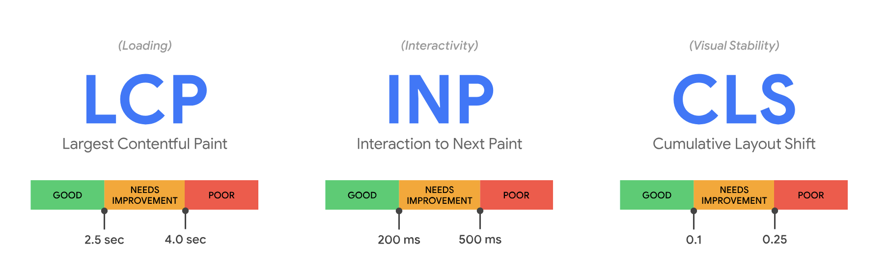
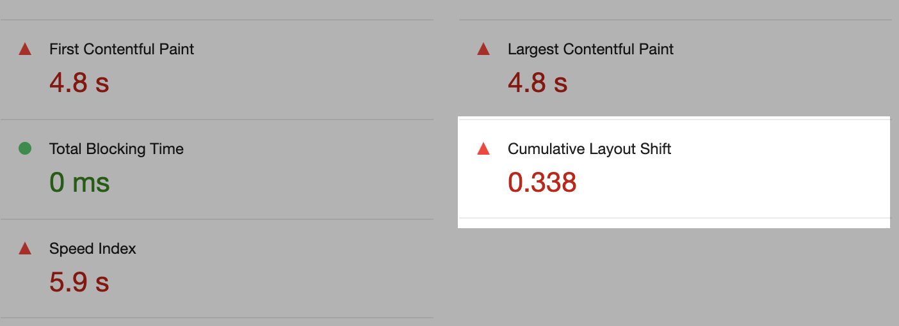
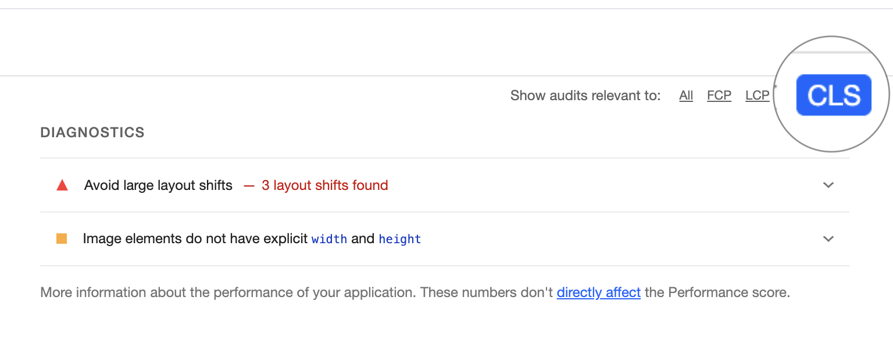

# Enhanced Website

## Layout Shifts

Over het ontwerpen en bouwen van websites waarbij de layout niet verspringt bij het laden van content.

### Wat is een Layout Shift?

Waarschijnlijk de vervelendste en makkelijkst op te lossen oorzaak van _User Experience_ problemen rondom Performance is de _Layout Shift_:

Als content nadat de pagina geladen en gerenderd is opeens verspringt, spreken we van een Layout Shift.

_Terwijl de gebruiker op de cancel knop wil klikken verspringt de layout waardoor per ongeluk op de bestel button wordt geklikt en de bestelling toch wordt gedaan_

Layout Shifts worden vaak veroorzaakt door video's of afbeeldingen zonder bekende afmetingen, lettertypes die later inladen en anders renderen dan de fallback, dynamische content die client-side wordt geladen, of bijvoorbeeld advertenties die zichzelf groter of kleiner maken nadat de pagina al geladen is.

🛠️ Maak een kleine `layout-shift` demo in je Learning Journal, waarin je bovenstaand probleem nabootst. We doen het hier bewust “verkeerd”, om te oefenen, en om dit patroon te leren herkennen.

💡 Tip: gebruik bijvoorbeeld `` als je een grote afbeelding wilt laden, of het driestappenplan in client-side JavaScript voor een micro-interactie.

#### Bronnen

- [Why Does Speed Matter van web.dev](https://web.dev/why-speed-matters/)

### Cumulative Layout Shift

In de [Performance Audit deeltaak](https://github.com/fdnd-task/performance-audit) kwam _Cumulative Layout Shift_ (CLS) ook al langs:

CLS is één van de drie _Core Web Vitals_, waarmee _visuele stabiliteit_ van een pagina gemeten wordt. De CLS score gaat over alle Layout Shifts die op een pagina voorkomen, ook na de initiële render.

CLS is een combinatie van verschillende oorzaken, met hetzelfde gevolg: Layout Shifts. De Core Web Vitals gaan over het gevolg voor de User Experience, niet over de oorzaken. Het kan best zijn dat CLS problemen worden veroorzaakt door én een groot lettertype, én een advertentie script dat rare dingen doet, én video's die pas laden nadat de pagina geladen is, én afbeeldingen die geen breedte en hoogte hebben meegekregen, én door de volgorde waarop deze allemaal geladen worden.

In de Diagnostics van een Lighthouse rapport vind je de verschillende problemen terug. Als frontender kun je een hoop doen aan deze problemen. Vandaag richten we ons op het oplossen van performance problemen die veroorzaakt worden door Layout Shifts van afbeeldingen.

👍 Let op: het is OK om niet alle problemen in één keer op te lossen. No worries. Als je performance wilt verbeteren, doe je dit met kleine stapjes, en focus je je steeds op één gebied.

Je kunt in Lighthouse filteren op specifieke Web Vitals, wat voor deze opdracht erg handig is.

🛠️ Doe een Lighthouse Performance test (Mobile) op je eigen project. Liefst op een pagina waar veel afbeeldingen op staan, zodat we wat problemen vinden die we kunnen gaan oplossen. _Throttle_ eventueel je netwerkverbinding (zeker als je op `localhost` test, want dan heb je geen vertraging door het netwerk). Maak een issue aan als je CLS problemen vindt. Analyseer de bevindingen van Lighthouse en voeg screenshots en mogelijke oplossingen of bronnen toe aan je analyse. Geef ook aan op welke pagina of pagina's de problemen plaatsvinden, zodat je weet om welke views het gaan. Performance problemen gaan bijna altijd over problemen in je HTML, en die zul je daar ook op moeten lossen.

💡 Tip: Zijn er verschillende oorzaken voor CLS? Maak dan per oorzaak een sub-issues aan

#### Bronnen

- [Cumulative Layout Shift (CLS)](https://web.dev/articles/cls)
- [Optimize Cumulative Layout Shift](https://web.dev/articles/optimize-cls)
- [Understand the critical path](https://web.dev/learn/performance/understanding-the-critical-path)
- [Lighthouse performance scoring](https://developer.chrome.com/docs/lighthouse/performance/)
- [Web Vitals](https://web.dev/articles/vitals)

<!-- 

- Rabo app

- Theorie + Onderzoekje
- Laten zien hoe je dat in Directus + Liquid kunt fiksen -> opdracht: pas toe in de leertaak
- Issue aanmaken -> CLS Issues testen in al je views -> fiksen

Voorbeeld van Layout shift die laat zien waaron dat slecht is voor de gebruikers ervaring. 

Opdracht: Layout shifts onderzoeken? 
Weten we websites waar een layout shift in zit die studenten kunnen uitproberen door de internetsnelheid te throttlen?

Setting Height And Width On Images Is Important Again
https://www.smashingmagazine.com/2020/03/setting-height-width-images-important-again/

Opdracht: Spelen met width en height en de pagina laten met super traag internet.

Opdracht: Dit kan ook met Directus 
Zorg dat je de image width en height fields ook opvraagt
`...?fields=*,image.id,image.height,image.width`
Gebruik deze eigenschappen in je HTML views

-->
