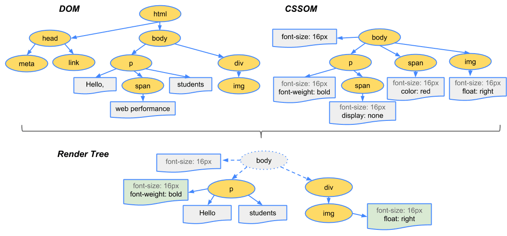

# Enhanced Website

## Wat is Performance?

Zo zegt Léonie Watson

> Accessibility == Performance

Binnen FDND is het de laatste van de Vier Grote Principes waarmee we _RAPPE_ websites maken:

- Responsive
- Accessible
- Performant
- Progressively Enhanced

Uiteindelijk heeft het allemaal met elkaar te maken: _Goede Websites Maken_.

Er zijn veel onderzoeken en case studies bekend, over hoe de snelheid van een website de _User Experience_ beïnvloedt. De gevolgen van een goede User Experience zijn vaak te meten in conversie, waardoor dit Principe zich ook makkelijk terugverdient. Er is dus veel werk te vinden in de Performance niche. En vaak zorgt een focus op performance ook weer verbeteringen op andere vlakken.

### Render tree

Voor frontenders heeft performance alles te maken met hoe browsers websites op het scherm toveren. Heel simpel gezegd: HTML en CSS worden via het _Document Object Model_ (DOM) en het _CSS Object Model_ (CSSOM) gecombineerd tot een _render tree_.

Zodra de render tree bekend is, kan een browser pixels gaan tekenen. En hoe eerder de browser pixels heeft getekend, des te sneller de site voelt. Oftewel: hoe eerder de browser de render tree kan maken, des te sneller de site voelt. Oftewel: hoe eerder de browser de DOM en de CSSOM heeft kunnen maken, des te sneller de site voelt. Oftewel: hoe eerder de browser de HTML en CSS tot z'n beschikking heeft, des te sneller de site voelt. Klinkt heel logisch, maar hier worden heel veel fouten mee gemaakt.

### Critical rendering path

HTML en CSS zijn onderdeel van de _critical rendering path_. Client-side JavaScript kan deze eigenlijk alleen maar vertragen. Daarom is het ons doel om zo efficiënt mogelijke HTML en CSS bij de browser af te leveren.

De render tree maken gebeurt dus allemaal in de browser. En zoals jullie weten uit Sprint 9, zijn er veel verschillen tussen browsers, rendering engines en apparaten. Waar wij op werken en ontwikkelen, is niet representatief voor de rest van de wereld. De meeste apparaten zijn trager, en daar moeten we dus rekening mee houden.

Maar er zijn nog veel meer variabelen die de performance van websites kunnen beïnvloeden, zoals je net aan de Lighthouse tests hebt gezien.

### Bronnen

- [Why Does Speed Matter van web.dev](https://web.dev/why-speed-matters/)
- [WPO Stats](https://wpostats.com/)
- [Critical rendering path @ MDN](https://developer.mozilla.org/en-US/docs/Web/Performance/Guides/Critical_rendering_path)
- [Render-tree Construction, Layout, and Paint @ web.dev](https://web.dev/articles/critical-rendering-path/render-tree-construction)

## Opdracht Break the Web

We gaan het Web laten 'breken' door features van het platform bewust uit te zetten: snelheid, afbeeldingen, custom fonts, content/ad blockers & JavaScript. Veel gebruikers gebruiken browser extensies om dit soort features aan te passen. Hierdoor worden sites misschien wel sneller, maar er gebeurt nog veel meer.

Onderzoek met je tafel _één van de onderstaande features_. Dat betekent uitvogelen wat het voor impact heeft op de sites die je kent en normaal gebruikt. Kies verschillende sites uit je directe omgeving: van je werkgever, lokale vereniging of de cafetaria om de hoek.

Maak als groep een presentatie en presenteer jullie bevindingen aan de squad. 
Maak een korte presentatie met daarin:

- Leg uit hoe je de feature kunt testen, veranderen of uitzetten in verschillende browsers
- Leg uit welke extensies hiervoor ingezet kunnen worden, en hoe makkelijk die werken
- Leg uit waar normale eindgebruikers tegenaan lopen; wij web developers zijn een uitzondering
- Toon de problemen, cijfers, meningen en onderzoeken
- Leg uit hoe je de problemen zou kunnen oplossen of voorkomen

Je krijgt hiervoor 1 uur de tijd, daarna vertel je je bevindingen aan de squad.

### Features

1. Internet snelheid
2. Afbeeldingen
3. Custom fonts/icon fonts
4. Content/Ad blockers
5. JavaScript (volledig)

#### Internet snelheid
Onderzoek hoe websites werken als iemand met een hele lage internet snelheid websites bezoekt. Kun je dit zelf instellen in je browser of Operating System? Hoeveel mensen hebben toegang tot 5G? En 4G? 3G?

#### Afbeeldingen
Onderzoek wat er gebeurt als plaatjes niet kunnen worden getoond. Wanneer gebeurt dit? Is dit in te stellen? Wat als je data wilt besparen op je telefoon? Zijn er CDN's die iets veranderen aan afbeeldingen? Of Internet Service Providers die dingen optimaliseren? Gaat dat altijd goed?

#### Custom fonts (Icon fonts)
Onderzoek wat er gebeurt als custom fonts niet kunnen worden geladen en/of getoond. Of dat een icon font niet goed werkt. Werkt de site nog naar behoren? Wat krijg je te zien? Hoe populair zijn icon fonts? Is Font Awesome niet huge? Wat als zo'n font geblokkeerd wordt? Hoe makkelijk kunnen gebruikers dit zelf veranderen? Wie blokkeert Google Fonts? Of alles van Google? Zijn er populaire extensies die dit veroorzaken? Wat doen mensen met dislexie?

#### Ad/Tracking/Analytics/Content blockers
Onderzoek wat er gebeurt als content en/of ad blockers aan staan. Worden er delen verborgen? Welke blockers zijn populair? Wat doen die precies? Wat gebeurt er als je Google Analytics blokkeert? Hoe makkelijk kunnen gebruikers extensies hiervoor installeren in hun browser?

#### JavaScript (volledig)
Onderzoek wat er gebeurt als JavaScript uit staat, het niet goed doet of wordt geblokkeerd in verband met veiligheids-instellingen. Doet alles het nog? Werk het menu goed? Kun je formulieren nog wel gebuiken? Hoeveel extensies doen dit? Zijn die populair? Zijn er mensen met alu hoedjes die gewoon alles blokkeren? Is het Web überhaupt bruikbaar? Of is het juist een zegen?

## Deeltaak Performance Audit (12:00 uur)

Gebruik hiervoor de deeltaak, [Performance Audit](https://github.com/fdnd-task/performance-audit/).

Deze deeltaak kun je daarna toepassen op je huidige en komende leertaken.